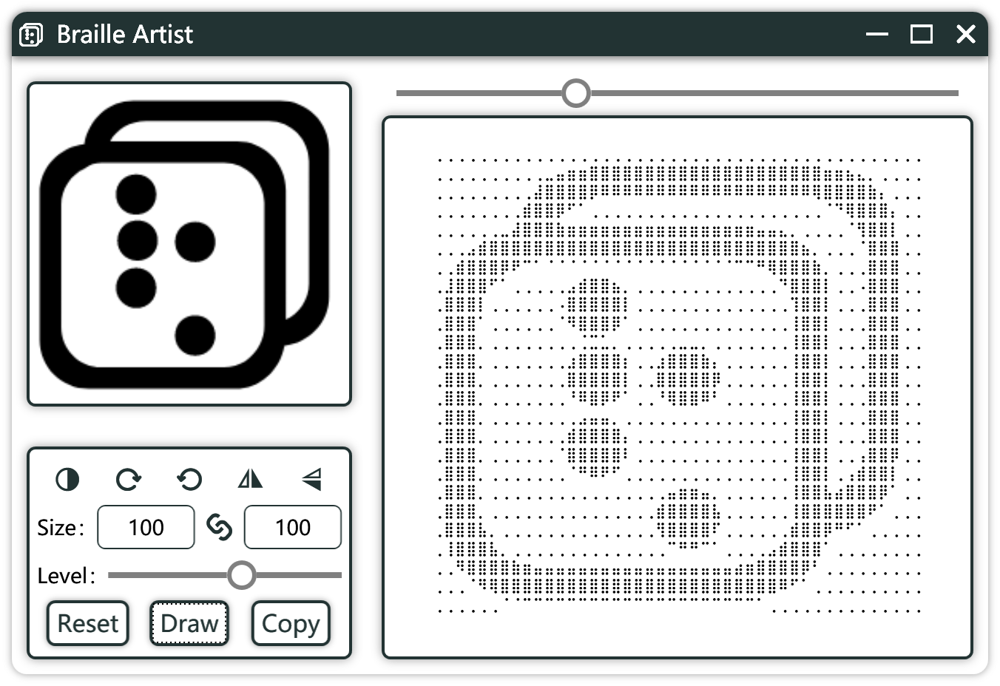

##

  
  <h1 align="center">Braille Artist</h1>

### Braille Artist is a braille ASCII art generator.

This is a braille ASCII art generator. The traditional  ASCII art generator is inefficient in space utilization. This software can use one braille as 8 pixels to generate ASCII art and display high-quality pictures in the text-only environment.

Built against C# .NET 4.5, Braille Artist at Windows platform.

### Language Support
 - English
 - 中文

### License

Braille Artist is licensed under the [GPL-3.0 License](https://fsf.org/)

### Built With

[Visual Studio](https://visualstudio.microsoft.com/)

## Manual build

If you prefer, you can compile Braille Artist yourself

- Using [Visual Studio 2019](https://visualstudio.microsoft.com/vs/)
  - Make sure you have the latest version installed
  - Make sure you have [the .NET Framework 4.5](https://dotnet.microsoft.com/download#windows) installed

Clone Braille Artist locally and getting start with Visual Studio.

## Usage

### Download Compiled EXE from [Releases](https://github.com/shadlc/BrailleArtist/releases)

### Open BrailleArtist.exe like this

  

### Change language
Braille Artist can change language by system language automatically.
If you want change language, please click the icon on upper left corner.

### Import Image
- Click or drag the file into the box which is in the upper left corner to import the image.

### Adjust
- there are some setting in the lower left corner. 
    - Five button at the top can adjust the properties of image.
    - Size textbox can scale the braille art as your like. Especially, this size just show the number of dot. In other words, one braille has eight dot.
    - The level slider allows users to customize the brightness of the braille art for different effects. 
- The slider in the upper right side can adjust the fontsize of the braille art for the best display size. You can also press Ctrl and scroll the mouse wheel on the braille art to zoom the size. 

 ### Generate
 - If the size of image is not very big, it can draw braille art automatically.
 - You can alse click the Draw button to redraw the braille art.
 - Finally, click the Copy button to copy the entire braille art to clipboard.
